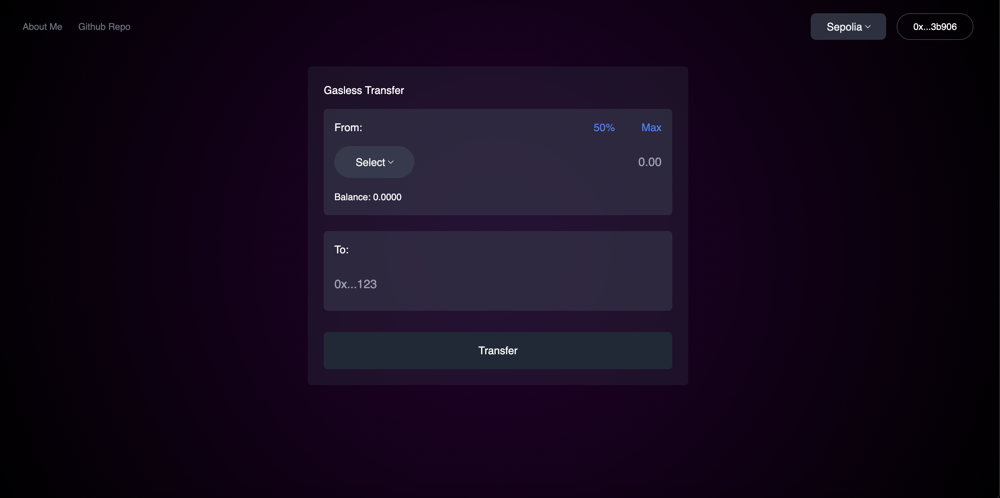
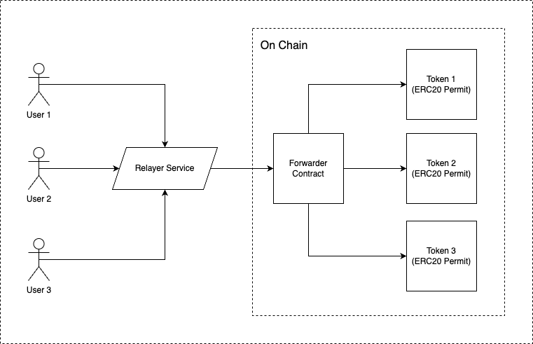

# 🪙 [ERC20](https://eips.ethereum.org/EIPS/eip-20) Multi Meta Transaction



# ⚙️ Architecture

A meta transaction is a method that allows users to interact with the Ethereum network without requiring ETH for gas fees. In this setup, a user signs a transaction with their private key, while a third-party (a relayer) submits this transaction to the network and pays the gas fees. The transaction data is typically structured and signed according to the [EIP-712](https://eips.ethereum.org/EIPS/eip-712) standard, enhancing security and readability. Furthermore, the [ERC20 Permit](https://eips.ethereum.org/EIPS/eip-2612)  method allows the token owner to delegate gas payments to another party, supporting the execution of the meta transaction. This process enhances the accessibility and usability of the Ethereum network, especially for users who do not hold ETH. To provide a better understanding, we've included a screenshot of the architecture.



## [EIP-712](https://eips.ethereum.org/EIPS/eip-712) - Typed Structured Data Hashing and Signing

EIP-712 is an Ethereum Improvement Proposal that provides a standard for structuring and displaying data in a human-readable format during Ethereum transactions. It improves the usability of signed data structures, making it easier for users to understand what 
they're signing.

## [ERC-2612](https://eips.ethereum.org/EIPS/eip-2612) - Permit Extension for EIP-20 Signed Approvals

ERC-20 permit, also known as EIP-2612, is a method used in Ethereum blockchain that allows holders of ERC-20 tokens to approve the spending of their tokens via a signature, instead of requiring an Ethereum transaction.

## Forwarder Contract

The smart contract `Forwarder.sol` extends the EIP712 and entails the following core functions.

- `verify`: Verifies the signature based on the typed structured data.

```
function verify(MetaTx calldata _tx, bytes calldata _signature) internal view returns (bool) {
    address signer = _hashTypedDataV4(
        keccak256(abi.encode(_TYPEHASH, _tx.from, _tx.to, _tx.token, _tx.amount, _tx.nonce))
    ).recover(_signature);

    return signer == _tx.from && nonces[_tx.from] == _tx.nonce;
}
```

- `batchTransfer` Executes meta transactions in batches. If one transaction is invalid or has a malformed signature, the process continues as long as the remaining transactions are valid.
```
function batchTransfer(MetaTxWithSig[] calldata _metaTxWithSig, uint256 gas) external onlyOwner {
    uint256 transactionsLength = _metaTxWithSig.length;

    for (uint256 i = 0; i < transactionsLength; ++i) {
        bytes calldata signature = _metaTxWithSig[i].signature;
        MetaTx calldata metaTx = _metaTxWithSig[i].metaTx;

        if (verify(metaTx, signature) && whitelistedTokens[IERC20(metaTx.token)] && metaTx.to != address(0)) {
            nonces[metaTx.from] = nonces[metaTx.from] + 1;
            metaTx.token.transferFrom(metaTx.from, metaTx.to, metaTx.amount);
        }

        require(gasleft() > gas / 63, "Not enough gas");
    }
}
```

## ERC20 Permit token

Here's the sample implementation of ERC20 Permit

```
contract Token1 is ERC20, ERC20Permit {
    constructor() ERC20("Token1", "T1") ERC20Permit("Token1") {
        _mint(msg.sender, 1000000 * 10 ** 18);
    }
}
```

# ⚡️ Demo


# 💻 Development
For this project to function, [Redis](https://redis.io/download/) must be installed, serving as our database to store transaction data.

After you clone the repository, change your directory to the project's directory and run the following commands:

#### 1. Copy the environment variables from `frontend` and `relayer` workspaces
```
cp frontend/.env.development frontend/.env
cp relayer/.env.development relayer/.env
```

#### 2. Install npm modules
```
yarn install
```

#### 3. Start the Redis server. In your terminal simply run:
```
redis-server
```

#### 4. Start [Hardhat](https://hardhat.org/) local node server. Open a new tab in your terminal, change directory to the `contracts` folder and simply run:
```
npx hardhat node
```

#### 5. Deploy the smart contracts. Open a new tab in your terminal, simply run:
```
yarn contracts:deploy:localhost
```

It should display something like this in your terminal.
```
Forwarder deployed to: 0x...123
Token1 whitelisted and deployed to 0x...123
Token2 whitelisted and deployed to 0x...123
Token3 whitelisted and deployed to 0x...123
```

#### 6. Setup the environment variables

In the relayer workspace, copy and paste the deployed forwarder contract address, along with the private key of Hardhat's deployer, typically designated as account index 0.
```
FORWARDER_LOCALHOST_ADDRESS=
PRIV_KEY=
```

In the `frontend` workspace, copy and paste as well the forwarder contract address.
```
NEXT_PUBLIC_FORWARDER_LOCALHOST_ADDRESS
```

Same in the `frontend` workspace, copy and paste the tokens address in the `blockchain.ts` file under the `utils` folder.
```
token: {
    tokens: [
        {
        address: {
            localhost: '0x...',
            sepolia: '',
            goerli: ''
        }
        },
        {
        address: {
            localhost: '0x..',
            sepolia: '',
            goerli: ''
        }
        },
        {
        address: {
            localhost: '0x..',
            sepolia: '',
            goerli: ''
        }
        }
    ],
}
```

#### 7. Open and new tab and run the `relayer` server
```
yarn relayer:dev
```

#### 8. Open and new tab and run the `frontend`
```
yarn frontend:dev
```

#### 9. In your browser, navigate to `localhost:3000`. And that's is you successfully run the project. Have fun! 😄

# 🧪 Unit Tests

We utilize [Hardhat](https://hardhat.org/) given its robust capabilities for testing smart contracts, encompassing Solidity debugging and clear error messages.

To run the test suite. Simply run:

```
yarn contracts:test
```

Here's the sample report from the contract's test suite

```
·--------------------------------|----------------------------|-------------|-----------------------------·
|      Solc version: 0.8.17      ·  Optimizer enabled: false  ·  Runs: 200  ·  Block limit: 30000000 gas  │
·································|····························|·············|······························
|  Methods                                                                                                │
··············|··················|··············|·············|·············|···············|··············
|  Contract   ·  Method          ·  Min         ·  Max        ·  Avg        ·  # calls      ·  usd (avg)  │
··············|··················|··············|·············|·············|···············|··············
|  Forwarder  ·  batchTransfer   ·           -  ·          -  ·     547434  ·            1  ·          -  │
··············|··················|··············|·············|·············|···············|··············
|  Forwarder  ·  whitelistToken  ·           -  ·          -  ·      46764  ·            3  ·          -  │
··············|··················|··············|·············|·············|···············|··············
|  Token1     ·  permit          ·       77091  ·      77103  ·      77099  ·            3  ·          -  │
··············|··················|··············|·············|·············|···············|··············
|  Token1     ·  transfer        ·       52143  ·      52155  ·      52151  ·            3  ·          -  │
··············|··················|··············|·············|·············|···············|··············
|  Token2     ·  permit          ·       77067  ·      77103  ·      77087  ·            3  ·          -  │
··············|··················|··············|·············|·············|···············|··············
|  Token2     ·  transfer        ·       52143  ·      52155  ·      52151  ·            3  ·          -  │
··············|··················|··············|·············|·············|···············|··············
|  Token3     ·  permit          ·       77091  ·      77103  ·      77095  ·            3  ·          -  │
··············|··················|··············|·············|·············|···············|··············
|  Token3     ·  transfer        ·       52143  ·      52155  ·      52151  ·            3  ·          -  │
··············|··················|··············|·············|·············|···············|··············
|  Deployments                   ·                                          ·  % of limit   ·             │
·································|··············|·············|·············|···············|··············
|  Forwarder                     ·           -  ·          -  ·    1924066  ·        6.4 %  ·          -  │
·································|··············|·············|·············|···············|··············
|  Token1                        ·           -  ·          -  ·    2269191  ·        7.6 %  ·          -  │
·································|··············|·············|·············|···············|··············
|  Token2                        ·           -  ·          -  ·    2269191  ·        7.6 %  ·          -  │
·································|··············|·············|·············|···············|··············
|  Token3                        ·           -  ·          -  ·    2269191  ·        7.6 %  ·          -  │
·--------------------------------|--------------|-------------|-------------|---------------|-------------·
```

# 📜 License

This project is licensed under [GNU General Public License v3](https://opensource.org/license/gpl-3-0/).